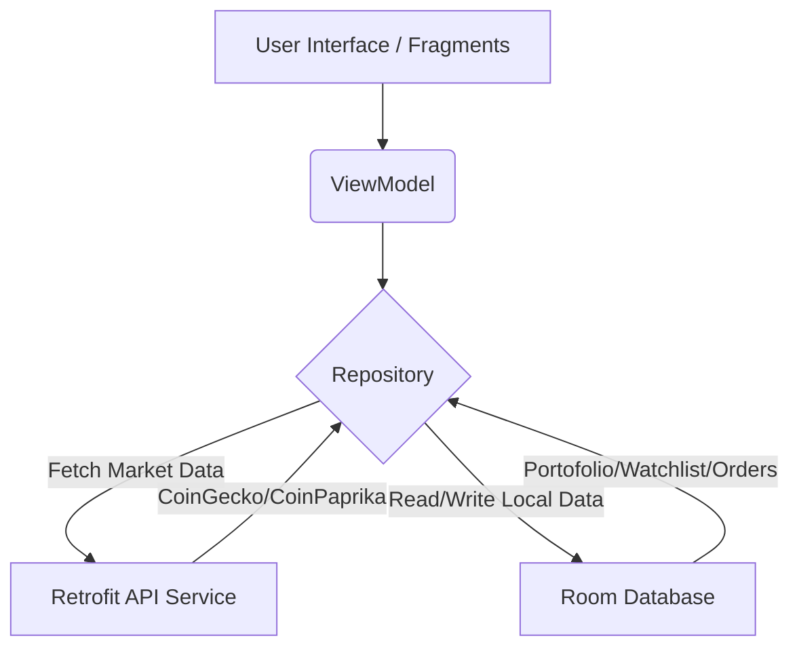

# 📈 Frexa - Ultimate Crypto Tracking & Mock Trading App

<p align="center">
   
</p>

<p align="center">
  <b>Frexa</b> adalah aplikasi Android modern yang dirancang untuk memantau pasar cryptocurrency secara real-time, mengelola portofolio, memantau koin favorit melalui watchlist, dan melakukan simulasi perdagangan kripto (mock trading). Dibangun dengan fokus pada antarmuka yang bersih dan performa tinggi untuk memberikan pengalaman pengguna terbaik dalam memantau aset kripto.
</p>

<p align="center">
  
  
  
  
  
  
</p>

---

## 🚀 Fitur Utama

### 📊 Real-Time Market Data
Frexa terintegrasi dengan berbagai API terpercaya seperti **CoinGecko**, **CoinPaprika**, dan **Alternative.me** untuk menyajikan harga kripto, perubahan 24 jam, kapitalisasi pasar, dan indeks *Fear & Greed* secara akurat dan tepat waktu.

### 💼 Portfolio Management
Kelola dan pantau seluruh aset kripto Anda di satu tempat. Aplikasi menggunakan database lokal (**Room Database**) untuk menyimpan riwayat transaksi dan menghitung total nilai portofolio serta profit/loss secara otomatis.

### 🌟 Smart Watchlist
Tambahkan koin-koin favorit Anda ke dalam Watchlist untuk akses cepat. Anda dapat memantau pergerakan koin pilihan tanpa perlu mencarinya dari ribuan daftar koin yang ada.

### 💱 Simulasi Perdagangan (Mock Trading)
Fitur *Order Bottom Sheet* yang memungkinkan Anda untuk melakukan simulasi beli/jual kripto (mock trading). Cocok bagi pemula yang ingin belajar *trading* tanpa risiko menggunakan uang sungguhan, karena semua transaksi dicatat di database lokal.

### 🎨 Modern & Responsive UI
Dibangun menggunakan **Material Design 3** dengan antarmuka yang intuitif. Memanfaatkan *ViewBinding* dan arsitektur **MVVM** untuk interaksi pengguna yang responsif, *Swipe to Refresh*, dan transisi layar yang mulus.

---

## 📊 Alur Kerja Aplikasi (Workflow)

Berikut adalah diagram arsitektur data pada Frexa:



---

## 🛠️ Arsitektur & Teknologi

Frexa menggunakan arsitektur modern standar industri yang tangguh:

* **Arsitektur MVVM (Model-View-ViewModel)**: Memisahkan logika UI dari logika bisnis, membuat kode lebih bersih dan mudah dipelihara.
* **Retrofit 2 & OkHttp3**: Networking asynchronous berkinerja tinggi untuk *fetching* data pasar.
* **Room Persistence Library**: Abstraksi tingkat tinggi dari SQLite untuk manajemen database lokal yang aman dan thread-safe.
* **LiveData & ViewModel**: Penanganan siklus hidup UI (lifecycle-aware) untuk mencegah *memory leaks* dan *crash*.
* **Glide**: *Image loading library* yang cepat dan efisien untuk memuat logo koin dari jaringan.

---

## 🗄️ Skema Database Lokal (Room)

Database Frexa dikelola menggunakan **Room Database** (`FrxDatabase`). Berikut adalah entitas utama yang digunakan:

### 1. `CachedPriceEntity` (Harga Cache)
Menyimpan cache harga koin terakhir untuk akses offline atau meminimalisir pemanggilan API berulang.
* **Kolom**: `coinId` (PK), `symbol`, `name`, `currentPrice`, `priceChangePercentage24h`, `imageUrl`, `lastUpdated`.

### 2. `HoldingEntity` (Aset Portofolio)
Menyimpan aset kripto yang dimiliki pengguna di portofolio mereka.
* **Kolom**: `coinId` (PK), `symbol`, `amount`, `averageBuyPrice`.

### 3. `OrderEntity` (Riwayat Transaksi)
Menyimpan semua riwayat order beli/jual yang dilakukan.
* **Kolom**: `id` (PK), `coinId`, `type` (BUY/SELL), `amount`, `price`, `timestamp`.

### 4. `WatchlistEntity` (Daftar Pantauan)
Menyimpan daftar ID koin yang difavoritkan oleh pengguna.
* **Kolom**: `coinId` (PK), `addedAt`.

---

## 📂 Struktur Repositori

```text
Frexa/
│
├── app/
│   ├── build.gradle.kts        # Konfigurasi dependensi Gradle (Kotlin DSL)
│   └── src/
│       ├── main/
│       │   ├── AndroidManifest.xml
│       │   ├── java/com/diellabs/frexa/
│       │   │   ├── data/
│       │   │   │   ├── local/      # Room DB, DAO, Entities
│       │   │   │   ├── remote/     # Retrofit API Services & Models
│       │   │   │   └── repository/ # Crypto, Portfolio, Trading, Watchlist Repositories
│       │   │   ├── ui/             # Fragments untuk Home, Markets, Orders, Portfolio, Watchlist
│       │   │   ├── util/           # Helper classes (CurrencyFormatter, ThemeManager, etc.)
│       │   │   └── viewmodel/      # ViewModels untuk setiap layer UI
│       │   └── res/
│       │       ├── layout/         # Layout XML (ViewBinding supported)
│       │       └── values/         # Colors, Strings, Themes
│       └── test/                   # Unit testing local
```

---

## 🚀 Panduan Instalasi & Persiapan

### 1. Prasyarat Sistem
* **Android Studio Ladybug** atau versi terbaru.
* **JDK 17** terpasang dan dikonfigurasi di Android Studio.
* Smartphone fisik Android atau Emulator dengan **Android 7.0 (API 24)** atau lebih baru.

### 2. Konfigurasi Lingkungan (Optional)
Jika aplikasi menggunakan Gemini AI atau API eksternal dengan kunci rahasia, tambahkan kunci tersebut di file `gradle.properties` global atau secara lokal:
```properties
# gradle.properties (Global)
GEMINI_API_KEY="API_KEY_ANDA_DISINI"
```

### 3. Kompilasi & Jalankan Aplikasi
Gunakan terminal Android Studio (PowerShell/Bash) untuk mengompilasi proyek:
```powershell
# Jalankan kompilasi debug apk (Output: app/build/outputs/apk/debug/app-debug.apk)
./gradlew assembleDebug

# Jalankan kompilasi release apk (Output: app/build/outputs/apk/release/app-release.apk)
./gradlew assembleRelease
```
Atau langsung klik tombol **Run** (▶) di panel atas Android Studio.

---

<p align="center">
  Dibuat dengan penuh kerja keras oleh <b>Muhammad Fadhil Mulyadi</b> untuk Ekosistem Kripto yang Lebih Baik.
</p>
